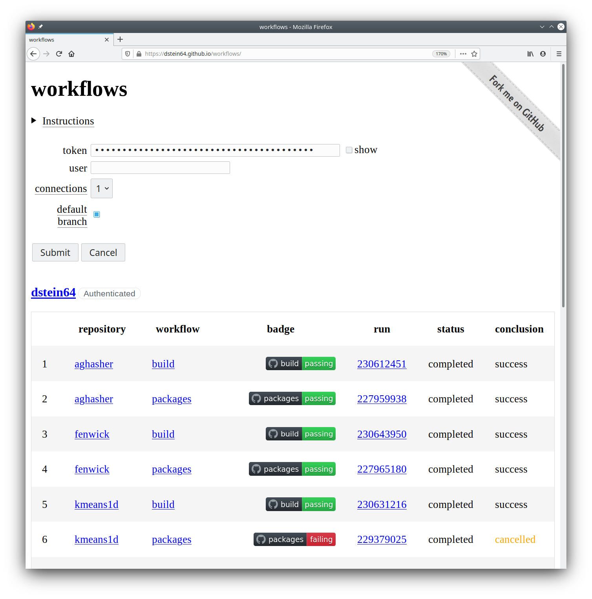

# workflows

*workflows* is a web page intended for viewing the status of GitHub workflows across
your repositories.

*workflows* is available at https://dstein64.github.io/workflows/.

License
-------

The source code has an [MIT License](https://en.wikipedia.org/wiki/MIT_License).

See [LICENSE](LICENSE).
